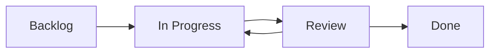

# 🚀 YONI Project Operations

> Organisationsstruktur für Launch, Task-Management und Workflow-Koordination

---

## 📁 Verzeichnisstruktur

```
project-ops/
└── launch/
    ├── README.md                 # Diese Datei
    ├── notion-template.json      # Notion-Template für Task-Management
    ├── tasks-build.csv          # BUILD Pillar Tasks
    ├── tasks-payment.csv        # PAYMENT Pillar Tasks
    └── tasks-youtube.csv        # YOUTUBE Pillar Tasks
```

---

## 🧱 Task-Pillars

Das YONI-Projekt ist in drei strategische Säulen (Pillars) organisiert:

| Pillar | Icon | Fokus | Beispiele |
|---------|------|--------|-----------|
| **BUILD** | 🧱 | Technisches Fundament | Stripe Webhook fixen, Deploy testen, API optimieren |
| **PAYMENT** | 💳 | Monetarisierung & Compliance | Instant Payment aktivieren, Checkout-Link einrichten, DSGVO |
| **YOUTUBE** | 🎥 | Reichweite & Conversion | Short drehen, Community-Post mit Stripe-Link, Marketing |

---

## 🪄 Quickstart (lokal)

### 1. Repository klonen

```bash
git clone https://github.com/pappensex/YONI-app.git
cd YONI-app/project-ops/launch
```

### 2. JSON-Template prüfen

```bash
# Template-Titel anzeigen
cat notion-template.json | jq '.title'

# Alle Pillars auflisten
cat notion-template.json | jq '.pillars[].name'

# BUILD-Pillar Details
cat notion-template.json | jq '.pillars[] | select(.name == "BUILD")'

# Workflow-Stages anzeigen
cat notion-template.json | jq '.workflow.stages'
```

### 3. CSV-Dateien prüfen

```bash
# BUILD Tasks anzeigen
head -n 5 tasks-build.csv

# Anzahl der Tasks pro Pillar
wc -l tasks-*.csv

# High Priority Tasks finden
grep "High" tasks-*.csv
```

---

## 📊 Notion Integration

### Template importieren

1. Öffne Notion und erstelle eine neue Datenbank
2. Verwende `notion-template.json` als Referenz für:
   - Datenbank-Properties
   - Pillar-Kategorien
   - Workflow-Stages
   - Task-Felder

### CSV-Import

1. In Notion: **New** → **Table** → **Import CSV**
2. Wähle eine der CSV-Dateien (`tasks-build.csv`, `tasks-payment.csv`, `tasks-youtube.csv`)
3. Mappe die Spalten zu den entsprechenden Properties
4. Wiederhole für alle drei Pillars

### Empfohlene Views

**Kanban Board** (nach Status):
- Spalten: Backlog, In Progress, Review, Done
- Gruppierung: Nach Status
- Sortierung: Nach Priority, dann Due Date

**Timeline View** (nach Due Date):
- Gruppierung: Nach Pillar
- Farbcodierung: Nach Priority

**Table View** (Master-Liste):
- Filter: Aktive Tasks (Status ≠ Done)
- Sortierung: Priority (High → Low), Due Date (ascending)

---

## 🎯 Workflow

### Task Lifecycle



### Status Definitions

| Status | Icon | Beschreibung | Nächster Schritt |
|--------|------|--------------|------------------|
| **Backlog** | 📋 | Task ist geplant, aber noch nicht gestartet | Priorisieren und zuweisen |
| **In Progress** | 🔄 | Task wird aktiv bearbeitet | Zur Review schicken |
| **Review** | 👀 | Task wartet auf Code Review oder Testing | Freigeben oder zurück zu In Progress |
| **Done** | ✅ | Task ist abgeschlossen und deployed | Archivieren |

### Priority Guidelines

- **High**: Blockiert andere Tasks oder ist zeitkritisch (Launch-relevant)
- **Medium**: Wichtig, aber nicht blockierend
- **Low**: Nice-to-have, kann verschoben werden

### Effort Estimation

- **Small (1-2h)**: Konfiguration, kleine Fixes
- **Medium (3-8h)**: Feature-Implementierung, moderate Komplexität
- **Large (1-3d)**: Große Features, mehrere Dependencies
- **X-Large (>3d)**: Epics, sollten in kleinere Tasks aufgeteilt werden

---

## 📋 Task Templates

### BUILD Task Template

```csv
Task Name,Pillar,Category,Status,Priority,Assignee,Due Date,Tags,Effort,Description
"Feature: XYZ",BUILD,Backend,Backlog,Medium,,YYYY-MM-DD,feature,Medium (3-8h),"Detailed description"
```

### PAYMENT Task Template

```csv
Task Name,Pillar,Category,Status,Priority,Assignee,Due Date,Tags,Effort,Description
"Payment: XYZ",PAYMENT,Stripe Integration,Backlog,High,,YYYY-MM-DD,urgent;feature,Medium (3-8h),"Detailed description"
```

### YOUTUBE Task Template

```csv
Task Name,Pillar,Category,Status,Priority,Assignee,Due Date,Tags,Effort,Description
"Content: XYZ",YOUTUBE,Content Creation,Backlog,Medium,,YYYY-MM-DD,feature,Large (1-3d),"Detailed description"
```

---

## 🔗 Quick Links

- **Repository**: [github.com/pappensex/YONI-app](https://github.com/pappensex/YONI-app)
- **Documentation**: [README.md](../../README.md)
- **Deployment**: [yoni.vercel.app](https://yoni.vercel.app)
- **Website**: [yoni.pihoch2.me](https://yoni.pihoch2.me)

---

## 🛠️ Tools & Utilities

### JSON Validation

```bash
# Validate JSON structure
jq empty notion-template.json && echo "✅ Valid JSON" || echo "❌ Invalid JSON"

# Pretty-print JSON
jq '.' notion-template.json
```

### CSV Statistics

```bash
# Count tasks by pillar
for file in tasks-*.csv; do
    echo "$(basename $file): $(($(wc -l < $file) - 1)) tasks"
done

# Find urgent tasks
grep -h "urgent" tasks-*.csv | cut -d',' -f1 | sort
```

### Merge all CSVs

```bash
# Create master CSV with all tasks
(head -n 1 tasks-build.csv && tail -n +2 tasks-*.csv) > tasks-all.csv
```

---

## 📝 Best Practices

1. **Atomic Tasks**: Jeder Task sollte in sich abgeschlossen sein
2. **Clear Descriptions**: Beschreibungen sollten selbsterklärend sein
3. **Dependencies**: Verlinke abhängige Tasks in der Description
4. **Regular Updates**: Status mindestens täglich aktualisieren
5. **Code Review**: Alle BUILD/PAYMENT Tasks benötigen Code Review
6. **Documentation**: YOUTUBE Tasks sollten Marketing-Materialien verlinken

---

## 🎨 Pillar-Farbschema

In Notion oder anderen Tools empfohlene Farben:

- **BUILD**: 🟣 Purple (`#9966CC`) – Passt zum YONI Überhochglitzer Theme
- **PAYMENT**: 🟢 Green (`#2ECC71`) – Assoziation mit Geld und Growth
- **YOUTUBE**: 🔴 Red (`#FF0000`) – YouTube Brand Color

---

## 📊 Metrics & Reporting

### Weekly Reports

Nutze diese Queries für wöchentliche Status-Updates:

```bash
# Tasks abgeschlossen diese Woche
# (manuelle Filterung nach Done + aktuellem Datum)

# Offene High-Priority Tasks
grep ",High," tasks-*.csv | grep -v "Done"

# Überfällige Tasks
# (manuelle Prüfung der Due Dates)
```

### Launch Readiness

Checkliste für Go-Live:

- [ ] Alle High-Priority BUILD Tasks Done
- [ ] Stripe Payment Flow getestet (PAYMENT)
- [ ] Mindestens 3 YOUTUBE Shorts veröffentlicht
- [ ] DSGVO Compliance dokumentiert
- [ ] Security Audit abgeschlossen
- [ ] Performance Tests ≥ 95 (Lighthouse)

---

## 🤝 Contributing

Neue Tasks hinzufügen:

1. Task in passende CSV-Datei eintragen
2. Stelle sicher, dass alle Pflichtfelder ausgefüllt sind
3. Commit mit Prefix: `[TASK]`, z.B. `[TASK] Add Stripe refund task to PAYMENT`
4. Pull Request erstellen

---

## 📄 Changelog

### v1.0.0 (2025-11-12)

- ✨ Initial project-ops structure
- 📊 Notion template with 3 pillars (BUILD, PAYMENT, YOUTUBE)
- 📋 CSV task lists for each pillar
- 📖 Comprehensive documentation

---

**Maintainer**: [@pappensex](https://github.com/pappensex)  
**Last Updated**: 2025-11-12  
**Status**: 🟢 Active
